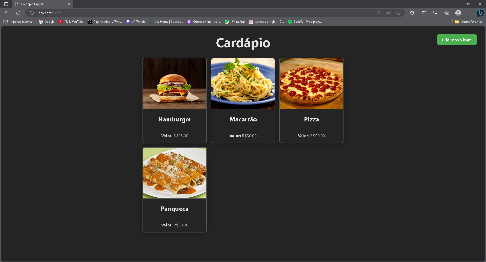
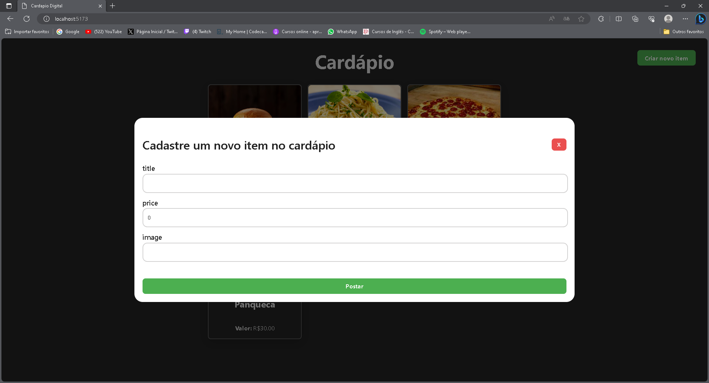

# Cardápio Digital - Aplicação Frontend

Este projeto é um simples protótipo de um Cardápio Digital desenvolvido durante um [tutorial no YouTube](https://www.youtube.com/@kipperdev) da @Fernanda-Kipper. A aplicação foi desenvolvida usando **React, Typescript e React Query**.

<h1 align="center">
    
    
</h1>

## 💻 Requisitos

Antes de iniciar, você deve ter o Node.js e o NPM instalados em sua máquina.

## 🚀 Instalando

Primeiro, você deve clonar o projeto na sua máquina, para isso você
pode colar o seguinte comando em seu terminal

```bash
git clone https://github.com/PedroZich22/frontend-cardapio-digital.git
cd cardapio
```

Para instalar as dependências, execute o seguinte comando:

```bash
npm install
```

Por fim, para executar o projeto basta rodar o seguinte:

```bash
npm run dev
```

## 🔧 Compilação

Para compilar a aplicação para produção, execute o seguinte comando:

```bash
npm run build
```

Isso irá gerar uma versão otimizada da aplicação na pasta `dist`.

## 🫂 Integração com Backend

👉 [Link do repositório](https://github.com/PedroZich22/backend-cardapio-digital)
